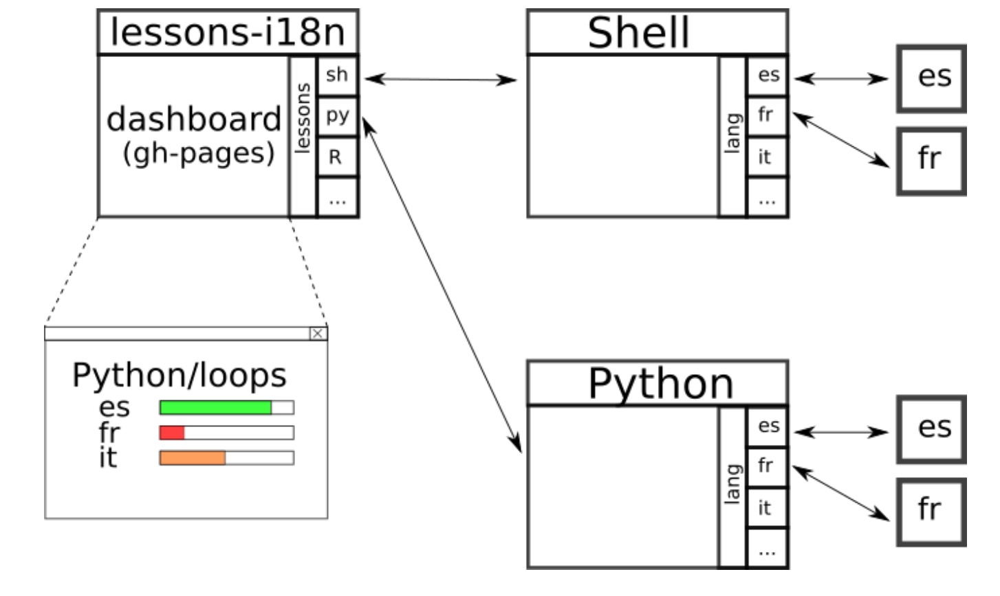

Collaborations Workshop 2018 - 2018-03-26

Carpentries platform to support translations -

HP5-CW18

**Hackday Idea Proposer**

David Pérez-Suárez - d.perez-suarez@ucl.ac.uk
---
*This document should be used to capture the information for a Hack Day Idea.*

**Problem**

Carpentries material is useful to everyone, even beyond than those that speak English. Many instructors have translated some or all of the lessons for workshops around the world...
However makes it difficult for central carpentries to keep an idea of what's been done and how direct new transtributors (translator contributors) to the right place.

**Solution**

I propose to use professional translations tools to this purpose! There's standards have been
used in many other projects. However they need some preprocessing. I've modified a tool to be able to tockenise md files (as used in the carpentries lessons). And now we only need to build the infrastructure that makes it easier. In my vision we can do that using travis, a bit of html-css, and git submodules (+github API) to orchestrate the whole system.

**Diagrams / Illustrations**

[James Baker] David et al: I edit the Programming Historian. We have a Spanish language initiative https://programminghistorian.org/es/ which has been going for nearly 2 years and translated 30 peer-reviewed lessons. We have an editorial team who might be useful and willing user testers for your work https://programminghistorian.org/project-team We have guidelines in place for what a translation initative needs to work well https://github.com/programminghistorian/jekyll/issues/378#issuecomment-369307840 If you want to chat about this and how PH and Carpentries could collaborate, let me know.

