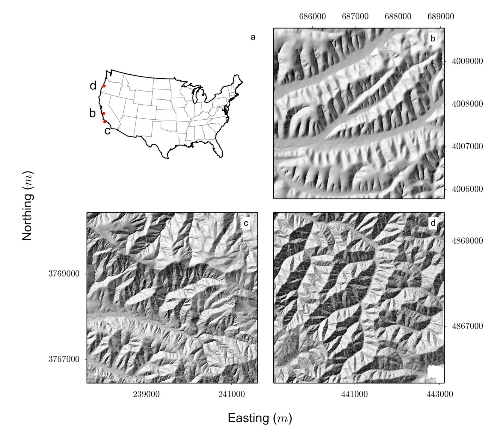

Collaborations Workshop 2018 - 2018-03-26

Geospatial metadata sharing

<http://swdg.io/cw18>- HP11-CW18

**Hackday Idea Proposer**

Stuart Grieve - stuart.grieve@gmail.com

---

*This document should be used to capture the information for a Hack Day Idea.*

**Context / Research Domain**

*Earth scientists who use topography data have a number of recognised data formats for their* grids. These files are O(100) MBs to O(10) GBs, and while there is infrastructure to manipulate these files, there is no easy way to share, regenerate, or even uniquely identify grids.*

**Problem**

*People cannot share large data files, but could just share the associated metadata and then regenerate the data locally. Raw data is available in archives and researchers typically cite the dataset they use but do not specify the bounds of the area of interest. Because people do not share their processed data, it becomes challenging to reproduce peoples work without dreaded emails or shipping hard drives.*

**Solution**

*“Least effort for most benefit”: Provide small scripts/programs to generate a reusable metadata information out of a large data file. Stretch goal to build a webapp rather than standalone scripts.*

*Most of the heavy lifting has been done for this via rasterio, gdal, and other code in the OGC ecosystem but needs stitching together.*

*Metadata needed:*

- *Dataset extent*
- *Coordinate system/projection info (OGC codes)*
- *DOI of original dataset*
- *DOI of associated paper (Optional)*

**Diagrams / Illustrations**

