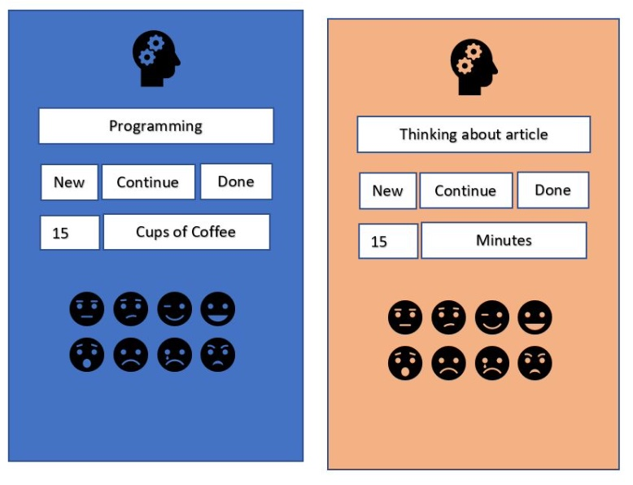

Collaborations Workshop 2018 - 2018-03-26

Productivity Approximator - HP7-CW18

**Hackday Idea Proposer**

M. H. Beals - drmelodeebeals@gmail.com

---

**Context / Research Domain**

Tracking productivity and mood (work-life-enjoyment balance)

**Problem**

In a world of increasing institutional, governmental and social metrics, we don’t need another one--or do we? Productivity is extremely difficult to track. Can we measure it in lines of code, miles run or words written? What about analysis, thought and revision? What about discussion?  How does “work done” really relate to “productivity”? And how does all this “work” affect us as human beings?

**Solution**

Create a smartphone app (or desktop app) that allows you to quickly record the following:

● Task: A note about what you’ve just done (not will do / doing)

● Task status: Was this a **new** task, are you **continuing** a task or are you now **done**?

● Quantitative record: Numerical record of how long your spent / how much you’ve finished
on the task, with drop down of counters: minutes, words, lines, coffees

● Mood at end of task: Happy / Unhappy, Excited / Bored, Anxious / Relaxed And provide mild metrics on how much you’ve done, and how certain tasks correlate with your mood / time / date. Are you happiest after a morning 100-word writing session or completing 3000 lines of code at 2am?

**Diagrams / Illustrations**

