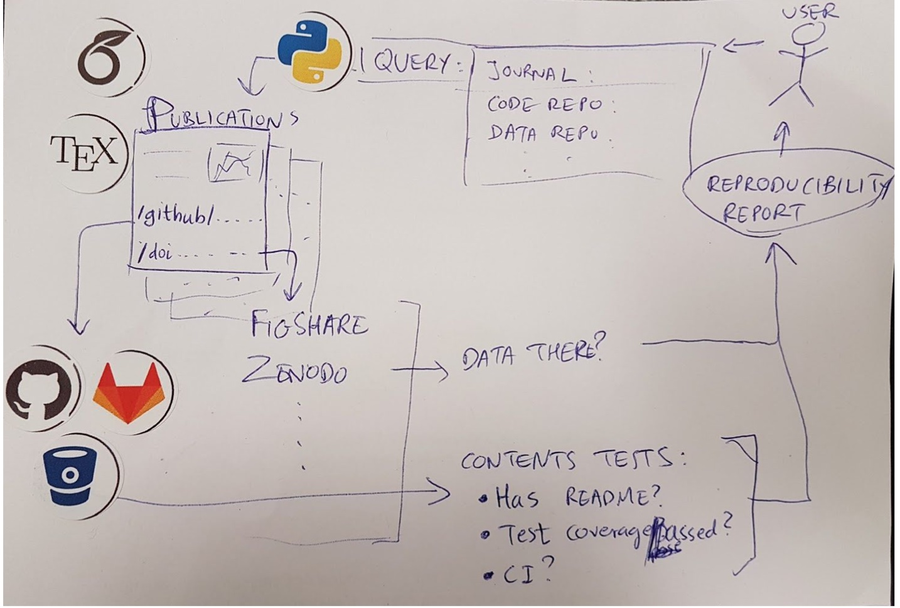

---
title: "Keeping up with the Joneses: Providing evidence for software and data citations in published papers"
author:
- Kirstie Whitaker
year: 2018
type: hack-ideas
tags:
---

Collaborations Workshop 2018 - 2018-03-26

Keeping up with the Joneses: Providing evidence for software and data citations in published papers - HP8-CW18

**Hackday Idea Proposer**

Kirstie Whitaker - kwhitaker@turing.ac.uk

---

**Context / Research Domain**

It’s not clear which journals and disciplines have citations to software and data and how their numbers are changing over time. In addition, it’s not clear whether these resources are still available, nor whether they meet community standards. Advocates for reproducible research have been calling for culture change for many years but it is often difficult to evidence how their recommendations have been adopted by the academic community. We are inspired by the Code is Science ([https://github.com/yochannah/code-is-science](https://github.com/yochannah/code-is-science/)) project and support the call for publisher guidelines for data and code sharing, including the implementations of mandates for certain journals.

**Problem**

Beyond reading an individual paper and manually testing the links it contains, it is difficult to know how many published academic papers share their data and their code. We believe that these are necessary (although not sufficient) to reproduce the analyses in the paper. By automating this search we will allow researchers and policy makers to see how the presence of links to data and software are changing over time so that they can adopt emergent behaviour in this regard. We want to provide a way to find numbers associated with the prevalence of code and data citations in the published literature in your domain.

**Solution**

We propose the creation of a web-application that will allow the user to select a corpus of published papers (e.g. from pubmed central) for analysis. The text of these papers will be searched and links to data and software extracted. For each such link the application will resolve the remote resource and if the resource exists a series of checks will be run to establish if. For example whether the source code repository contains a README file and licence. Data
resources will be checked for the existence of metadata. Results will be presented on a document by document basis, or statistically across the corpus. The application build upon the text matching work of a previous hack day: <https://github.com/SN-HackDay/code-cite> and build a new web interface and further features to resolve and check links for quality criteria.

**Diagrams / Illustrations**

