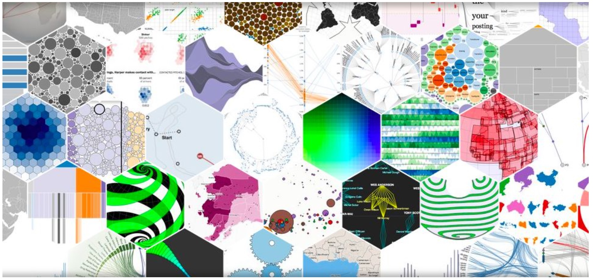

Collaborations Workshop 2018 - 2018-03-26

Choose-a-Visualisation - HP2-CW18

**Hackday Idea Proposer**

Neil Chue Hong - n.chuehong@googlemail.com
---

*This document should be used to capture the information for a Hack Day Idea.*

**Context / Research Domain**

Visualisation is important to most researchers, but we often don’t get much training in how to do it well.

**Problem**

*Description of the problem you are trying to solve*

Almost all researchers have to visualise data in some way, but in general (like Makefiles and
 many other things) we tend to learn a few simple examples and stick with them, even if they are not the most effective, efficient or exciting.

Like software engineering, visualisation is something which we don’t get a good grounding in but where a little guidance could go a long way.

What if there was a simple way to help researchers see what their data looks like visualised in different ways, along with advice on how to choose the appropriate one for the research
 problem they are trying to demonstrate?

**Solution**

Choose-a-visualisation would be a website that would allow a researcher to either upload their data, or link to a Google Sheet, answer a few questions about the data (e.g. whether data
ranges are nominal, ordinal or interval), and then it would generate a set of common visualisation types for that data.

Specific things that this service could do include:

● Helping researchers understand what visualisation types are useful for what types of data, either based on the dimensionality of the data, the data contents (e.g. the range of values), or the domain the researcher is in (e.g. do they tend to use specific plot types for certain data?

● Helping researchers understand if a different perspective might illuminate the data better, by demonstrating what the data looks like when visualised in a different way (either by focusing on a different subset of the data, visualisation type, changing axes,...)
● Help researchers move away from just relying on inappropriate simple visualisations (particularly if they only use Excel)
● Provide a way of downloading visualisation images for use
● Help reinforce good practice on the questions you should ask when visualising data

The D3.js gallery (https://github.com/d3/d3/wiki/Gallery) is a great way of seeing the different
 types of visualisation but what if you could see this with your own data?

**Diagrams / Illustrations**

Examples of D3 visualisations from D3js.org

