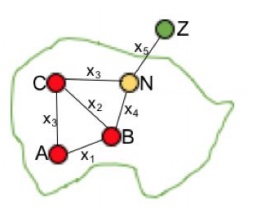

Collaborations Workshop 2018 - 2018-03-26

Automated Network Map construction -

HP13-CW18
---

**Hackday Idea Proposer**

Diana Suleimenova - diana.n.suleimenova@gmail.com

*This document should be used to capture the information for a Hack Day Idea.*

**Context / Research Domain**

*Please describe the context or research domain to which the problem applies*

An idea of constructing an automated network maps initiated from refugee simulation context. However, this can be useful for other scenarios where researchers or practitioners have multiple locations and require to know how these locations are connected and their distances represented visually. There are also other domains that use simulations for animal and bird migrations, as well as vehicle movements that require visual representations (i.e. network maps).

**Problem**

Prediction of refugee movements requires network maps. As, we have several locations, and
 identifying their connections, distances and constructing or visualising these links are time consuming. Hence, manually constructed network maps are proven to be inefficient at this moment.

**Solution**

Automated network map construction can be a tool (or website) to automate detection of locations, their route connections and distances. Hence, it can use a dataset (e.g. locations.csv) with location names and GPS coordinates (in csv format)

and construct network map by following the steps below:

1. Identify locations
2. Indicate these location and provide name
3. Connect locations
4. Provide distances between locations
5. Generate a file named routes.csv

**Diagrams / Illustrations**

Network map for Burundi

