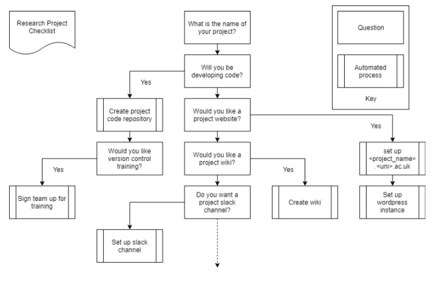

### Collaborations Workshop 2018 - 2018-03-26

Collaborative Ideas - Group I - CI5-CW18

### **Reporter**

Sam Cox - sam.cox144@gmail.com

### **Participants**

_Sam Cox, Yo Yehudi, Carina Haupt, Robert Haines, Stephan Druskat, John Robinson_

---

_This document should be used to capture the information for a Collaborative Session / Hack Day Idea. (The total amount of text should ideally be between 100-300 words and you can include a diagram or two). The document should be no larger than two pages of A4. Don’t delete the details at the top of the document but you should delete all the hint text once you no longer need it._

### ASAP - Automated Software-Assisted Provisioning

### **Context / Research Domain**

New research projects will usually need some sort of infrastructure around it. Understanding and fulfilling these infrastructural needs is not something that Principal Investigators will have high up on their todo list. What they do know, however, is what they are going to do in the course of the project. If they were required, before or when they start the project, to fill in an accessible web form detailing their needs based on their project’s aims - the submission of which would trigger automated provisioning of project infrastructure (websites, wikis, source code repositories, training session setup, etc.) -, this would help bridge the gap between researchers’ needs, best practices for research software engineering, and IT services.

### **Problem**

When new researchers join an organisation, or set up a new project, there are a number of possible code development tools and infrastructure modules they may (should?) be signed up to and have set up (for them or for their project members), e.g. a GitHub/Lab organisation, training requests. Individual institutes/universities may not know which questions to be asking, and individual researchers may not know what is available or useful at their institution.

### **Solution**

The idea is to ask researchers basic questions about their work to define the context of their work. Based on the given answers tools and information are (automatically) created and provided. This can include but is not limited to version control system, issue tracker, code reviewing systems as well as guidelines how to use these tools. Requests for specific training courses may also be included.

An important factor is not to provide all the tools and guidelines to the researchers, but to provide a list of recommendation adapted to their specific situation from which they can select. Therewith not giving them more requirements but recommendations.

This could extend to automated provisioning eventually.

### **Diagrams / Illustrations **

_Notes & discussions before selecting a single idea:_

1. _~~Code Is Science~~_
2. _~~CFF and CodeMeta~~_
3. _“Project Management for RSEs” - Advice for RSEs on handling multiple projects with restricted time and resource. MVP plus further features - keeps researcher in loop, agile methodology, allows prioritisation. Could be in Software Carpentry, or elsewhere. Also add checklist (4.) here?_
4. _Checklist for setting up a project - given a project size, what are the things I need to do to set up? E.g. version control, wiki, documentation, tests, CI, CD. Can move up to a higher class as and when these checklists are “complete”, but the checklist is not mandatory - flexible enough to make some parts optional. Provides a structure and guideline, rather than a process._
5. _Advice for how to set up a ‘first-timers-only’ system to get new users into your code ecosystem. Need to be a small problem, and provide guidance, advice, some hand-holding. ([https://www.firsttimersonly.com/](https://www.firsttimersonly.com/))_
6. _Automated layer over git for easier use. Automatic commiting in the background, and even automate collapse of those into sensible commits. Seems like SmartGit might have got there before us!_
7. _Automated project setup (checklist for PIs): What’s the shortname for your project? Do you need a website? Does it need a wiki section, etc.? Do you need a blog? Do you need a source code repository?_
    1. _Scientific code provisioning system… _

_MASTER_

*   _4. + 7._
