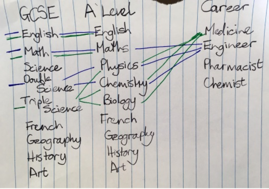

Collaborative Ideas for Group A - CI13-CW18

### **Reporter**

Mark Woodbridge - m.woodbridge@imperial.ac.uk

### **Participants**

Mark Woodbridge, Joanna Leng, Alexander Konovalov

---

## SCAT (STEM Career Advising Tool)

### **Context / Research Domain**

There is a persistent and pervasive lack of diversity in STEM

### **Problem**

Highly capable individuals frequently make education and career choices in the absence of relevant or up-to-date information about the qualifications or skills required for specific roles.

### **Solution**

Building a course choice modeller which will permit to model how further career path may be influenced by course choices. It will store information about prerequisites for further courses, and qualifications required for certain jobs. It will highlight further career paths which may be explored or blocked by choosing/dropping a certain course. Include role models and case studies, especially for non-traditional routes.

### **Diagrams / Illustrations**

