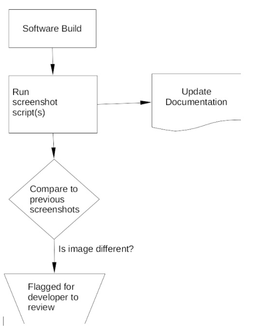

### Collaborations Workshop 2019 (CW19) #CollabW19          2019-04-01 to 2019-04-03

Automating Screenshots for Documentation - HP4-CW2CC

### **Hackday Idea Proposer**

Colin Sauze - cos@aber.ac.uk

---

_This document should be used to capture the information for a Hack Day Idea._

### **Context / Research Domain**

_Please describe the context or research domain to which the problem applies_

Any application with a graphical or web interface. 

### **Problem**

Keeping documentation and code in sync with each other automatically. Informing developers when the visual look of their application changes without them realising.

### **Solution**

Write a script using Selenium ([https://www.seleniumhq.org/](https://www.seleniumhq.org/)) to produce each screenshot. The script will specify the actions required to get the GUI in the right state for the screenshot and which part of the screen to capture. 

When building the software these scripts are re-run and update all the screenshots. Where the screenshot differs from its previous version the developer is alerted and differences are highlighted.

Selenium only works with web browsers (I think), need to find a similar tool that works with general GUIs. Suggestions welcome.

### **Diagrams / Illustrations**

_You can include diagrams in this section. Please ensure you have the right to use the image(s), and include an attribution if applicable._

