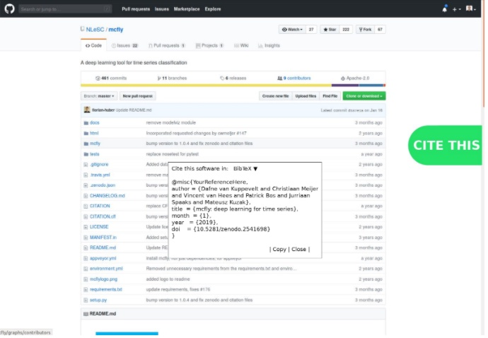

### Collaborations Workshop 2019 (CW19) #CollabW19  2019-04-01 to 2019-04-03

A "How to cite"/”Cite this” button for GitHub - HP1-CW2CC

### **Hackday Idea Proposer**

Stephan Druskat - stephan.druskat@dlr.de

---

_This document should be used to capture the information for a Hack Day Idea._

### **Context / Research Domain**

_Software citation_

### **Problem**

_To push general uptake of good practices of software citation - and the citation of software in general - it must be maximally easy for users of a software to access the relevant software citation metadata. A lot of research software is developed openly, and available on GitHub. But there is no really easy way to retrieve citation metadata through the GitHub UI directly, even if the relevant metadata is in the repository in metadata files (in a CITATION.cff or codemeta.json file). Not having easily consumable citation metadata for software impedes the progress of software citation._

### **Solution**

_Do you know the “[Unpaywall](https://unpaywall.org/products/extension)” browser extension button (unpaywall.org/products/extension) that helps you find an open access version of a paper? Let’s build this for GitHub, presenting the software citation metadata for a repository in a reusable manner! This should be developed openly, so that it can potentially be extended to work with different metadata formats (CITATION.cff, codemeta.json), and different output formats (e.g., BibTeX, RIS, etc.). It could be a browser extension or - taking a good aim at the bonus prizes - a bookmarklet._

### **Diagrams / Illustrations**

