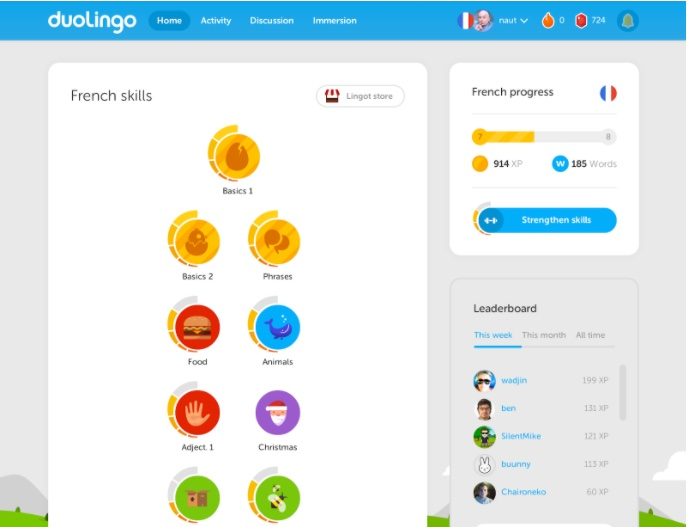

### Collaborations Workshop 2019 (CW19) #CollabW19          2019-04-01 to 2019-04-03

Creating a Lessons Roadmap and Profiency Framework for Software and Data Training - HP7-CW2CC

### **Hackday Idea Proposer**

Victor Koppejan & Jeremy Cohen

---

_This document should be used to capture the information for a Hack Day Idea._

### **Context / Research Domain**

_Please describe the context or research domain to which the problem applies_

Learners of software and data training topics.

Developers of software and data training material.

### **Problem**

_Description of the problem you are trying to solve_

At present, there is no “roadmap” which makes it easy for learners to understand what topics they should move on to next to improve their skills in the areas of software development and data analysis. Additionally, trainers have no standard framework that lets them tweak their lessons to different fields, by showing what skill topics and proficiency levels might be applicable to that field.

Although many existing initiatives have tried to map out learning progression, many are overly complex with a level of detail that is too confusing for people who do not have a primary background in the space. They often combine general concepts with specific tools and are hard to maintain and keep up to date.

What we would like is a representation of learning pathways/routes, with well-defined “prerequisites”, “learning outcomes” and “postrequisites”, that enables learners to understand what they could or should learn next, and would allow trainers to categorise/tagging their material. It then allows people to understand what are the most used / most useful things to learn in any particular discipline

### **Solution**

_Explanation of the solution to the problem you have identified_

The biggest challenge is understanding what level of detail / granularity the information on the nodes should be at, and how to agree what the links between nodes should be.

This hackday pitch would work on the following tasks:

*   Define a metadata schema for training material (or identify a suitable existing one)
*   Define specific metadata for existing lesson material (including relationship to other existing material, such as “prerequisites”, “learning outcomes” and “postrequisites”)
*   Define representation(s) for the metadata that can show relationships of interest to different types of viewers
*   Identify an existing infrastructure (e.g. Wikidata, GitHub, Graph databases) that can be used for implementing the representation of the roadmap in a way that makes it easy to maintain
*   Build tool(s) that visualize the relationships and the metadata. 
*   Determine how to maintain metadata over time.
*   Setup a reviewing procedure for the points above using existing github or equivalent frameworks.
*   (Very far fetched) build tools that automate the combination of lessons and build new syllabi based on the graph.

_Notes:_

*   _There’s a difference between the title of a lesson, and the category_
*   What’s the metadata schema that you need for each “location” on the roadmap?
    *   Relevant Domains
    *   Proficiency Level
    *   Programming Language
    *   Generality of lesson: E.g., general concept, specific tool
    *   “High level Topic / pathway”? E.g. Data analysis (or is it data cleaning - what level)?
    *   Could use expert judgement or could mine existing materials to identify what people are already using
*   What examples of this are there already in different areas?
    *   For teaching languages: [https://en.wikipedia.org/wiki/Common_European_Framework_of_Reference_for_Languages](https://en.wikipedia.org/wiki/Common_European_Framework_of_Reference_for_Languages)
    *   SFIAplus IT Skills Framework: [https://www.bcs.org/upload/pdf/sfiaplus-wallchart.pdf](https://www.bcs.org/upload/pdf/sfiaplus-wallchart.pdf)
    *   EU Digital Competency Framework: [http://publications.jrc.ec.europa.eu/repository/bitstream/JRC106281/web-digcomp2.1pdf_(online).pdf](http://publications.jrc.ec.europa.eu/repository/bitstream/JRC106281/web-digcomp2.1pdf_(online).pdf)

### **Diagrams / Illustrations**

_You can include diagrams in this section. Please ensure you have the right to use the image(s), and include an attribution if applicable._

