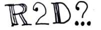
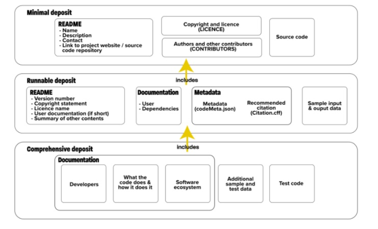
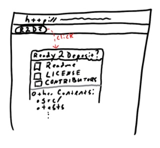
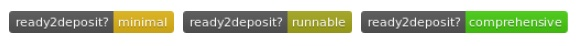

### Collaborations Workshop 2019 (CW19) #CollabW19          2019-04-01 to 2019-04-03

Discussion group 8 - Ready to deposit? - CI14-CW2CC

### **Reporter**

Stephan Druskat - stephan.druskat@dlr.de

### **Participants**

_Emily Bell_

_Dav Clark_

_Stephan Druskat_

_Robert Haines_

_Patrick McCann_

_Tom Russell_

Initial ideas discussion

*   Guidance for researchers on how to deposit software
    *   Ref: “Software Deposit: What to deposit” [https://doi.org/10.5281/zenodo.1327325](https://doi.org/10.5281/zenodo.1327325)
    *   Tool: Repository checker for what to deposit? Tool that checks all necessary files and metadata is available for 
        *   As a GitHub commit probot?
*   Tool: “Cite this” button for GitHub as browser extension
*   Out-of-order execution?!? - Proof-of-concept for tracking activity in Stencila
*   SemVer checker: Checks what your next version should be based on whether a system/integration/acceptance test suite breaks the API (up the major), doesn’t (up the minor), or looks like a bug fix (up the patch)

---

_This document should be used to capture the information for a Collaborative Session / Hack Day Idea. (The total amount of text should ideally be between 100-300 words and you can include a diagram or two). The document should be no larger than two pages of A4. Don’t delete the details at the top of the document but you should delete all the hint text once you no longer need it._

### **Context / Research Domain**

Software deposit; FAIR principles; Reproducible research

### **Problem**

People aren’t depositing their software enough -- even national institutions like libraries don’t have searchable archives of software which use their own collections.

Depositing their software would make it possible to have it cited according to the [Software Citation Principles](https://peerj.com/articles/cs-86/) (i.e., citing the thing itself, not a description of it, or a paper about it), acknowledging that software is on par in this respect with all other research output.

Deposits enable discoverability, reproducibility, sustainability, credit.

People just need to do it, but may not be sure if their software is ready for deposit yet.

### **Solution**

**Ready to Deposit?**

Provide an automated checklist for people to consult whenever they consider depositing a version of their software to an archival repository, such as Zenodo, figshare or an institutional archive.

The checklist is tied to version control systems - submit the link to your repository and the tool will provide a summary of existing and missing information. Some of this process will be automated; other parts will require input from the user. It will provide advice on how to complete any missing steps. The tool will certify the readiness of the software for deposit based on a three level scale, shown in figure 1. It will also provide automated deposit of the checked version to different archives upon completion of the checklist.

The tool will check for the existence of the following files for a minimal deposit:

*   README
*   LICENCE
*   CONTRIBUTORS

It will then ask the user about the contents of the README

It will check for a codeMeta.json and CITATION.cff file and ask the user if the relevant further details are present in the documentation and README for a runnable deposit.

It will ask the user about the additional features that are necessary for a comprehensive deposit.

A badge can be added to the ReadMe to indicate the deposit level readiness, see figure 3.

Hack day implementation suggestions:

*   Input boxes on a website
*   JS/Python command line tool
*   Bookmarklet (see figure 2)
*   GitHub App / webhook for GitLab / Bitbucket
*   Scaffold / skeleton generation
*   Badge

### **Diagrams / Illustrations**

Figure 1: The three levels of deposit readiness. From Michael Jackson. (2018, August 7). Software Deposit: What to deposit (Version 1.0). Zenodo. [http://doi.org/10.5281/zenodo.1327325](http://doi.org/10.5281/zenodo.1327325). 

Figure 2: A proposed UI for the R2D? Button.

Figure 3: Proposed badges for the three levels of deposit readiness.

