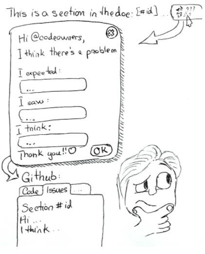

### Collaborations Workshop 2019 (CW19) #CollabW19          2019-04-01 to 2019-04-03

The Docutor button - CI18-CW2CC

### **Reporter**

Dan Hobley - dan.hobley@gmail.com

### **Participants**

Cerys Lewis, Connah Kendrick, Kirstie Whitaker, Adrian Castravete

### **Context / Research Domain**

Documentation enhancement

### **Problem**

In active projects, it’s very easy for documentation to get out of alignment with or superseded by subsequent code changes. Maintainers of open source projects are hugely overworked and underpaid, so even with the best will in the world, it’s very difficult for the experts who built the code and who wrote the original documentation to review it and catch any of the inconsistencies that appear over time.

In contrast, new users read the documentation very closely - it’s their welcome mat and guide to achieve the results they’re looking for. Many developers would like these users to update the documentation and fix these bugs themselves, but contributing to an open source project is often intimidating. New users may not know the expected workflow of opening an issue with the problem they’re having. Still more will feel presumptuous and worried about over burdening an already busy dev team.

### **Solution**

Users look over and interact with the documentation much more than developers, and also see it with “fresh” eyes. So we propose an inline button within Sphinx to allow reporting via Github/Gitlab of where users think they have identified places where the documentation is unclear, contradictory, or confusing. The button will link to a partially pre-populated, standardised form where they can easily report the issue in a friendly manner. This system will be very low friction (e.g., no sign-ins)!

An example workflow, is that a user can hover over the subheading for the section of the documentation page that they’re reading and see a 🤔 icon. When they click the 🤔 button a popup box appears that asks 1) What did you think this section should do? 2) What are you experiencing? 3) Do you have a suggested change for this section of the documentation? It will also ask if they - optionally - would like to be tagged in a GitHub issue about this report. On submission an issue at the host github repository will be opened that will link to the file and the specific section that was out of date, report the information provided by the user, and tag them if appropriate. The standard text will be friendly and appreciative. We want all maintainers to feel loved when they receive these - incredibly helpful - reports of inconsistencies in their documentation.

### **Diagrams / Illustrations**

