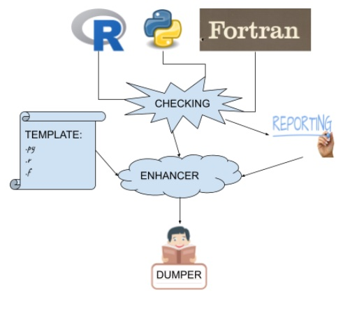

### Collaborations Workshop 2019 (CW19) #CollabW19          2019-04-01 to 2019-04-03

Group 11 - CI3-CW2CC 

 
DUQI

(Document Utility and Quality Interrogator)

### **Reporter**

Adam Jackson 

### **Participants**

Douglas Lowe ([douglas.lowe@manchester.ac.uk](mailto:douglas.lowe@manchester.ac.uk))

Becky Arnold ([rjarnold1@sheffield.ac.uk](mailto:rjarnold1@sheffield.ac.uk))

Arshad Emmambux ([a.emmambux@soton.ac.uk](mailto:a.emmambux@soton.ac.uk))

Adam Jackson ([a.j.jackson@physics.org](mailto:a.j.jackson@physics.org))

Diego Alonso-Álvarez ([d.alonso-alvarez@imperial.ac.uk](mailto:d.alonso-alvarez@imperial.ac.uk))

Carina Haupt ([carina.haupt@dlr.de](mailto:carina.haupt@dlr.de))

---

### **Context / Research Domain**

All research domains. Helping people improve their documentation.  \
Specifically this should benefit small projects without established documentation practices.

**Problem**

A common question researchers trying to improve their code quality ask is “how do I know if what I’ve written is good, and how do I know what I need to improve?”.  One of the biggest problems with code is poor documentation, with faults such as undefined variables, few comments, no docstrings and broken links. In many small projects, the majority of the documentation consists of comments within the codebase; and this is perfectly acceptable if that is easily navigable.

However there are not easy-to-use tools available for checking for faults such as these, and reporting them. While tools exist for automatic API documentation (e.g. Doxygen) they are relatively complicated and intended more for complex libraries than for the simple scripts that many researchers use for their own work (which can then, later, grow into shared libraries).

Checking documentation quality can be laborious and time consuming, especially for a pre-existing codebase. This means even for experienced coders that are fully aware of best practice, an automated documentation quality reporting tool would be highly desirable.

### **Solution**

A program which takes code files as input and provides a report/statistics about different facets of documentation quality. Checks/measures could include:

*   Success rate of external link resolution (i.e. find stale web links)
*   Comment to code ratio
*   Completeness of docstrings based on analysis of function definitions

Where possible these would be implemented in a generic way, allowing application to multiple programming languages (e.g. Python, R and Fortran) via a parsing/translation layer. This tool should also be extensible so that modules that check further facets of documentation quality can be included.

If time permits an extension to this project could be to add a documentation enhancement tool. Via this tool following reporting, _optional_ enhancements may be provided (e.g. missing function arguments and type specifications), allowing the coder to edit the existing information. A final step if there has been any enhancement will be to dump the new documentation back to the source code files.

### **Diagrams / Illustrations**

