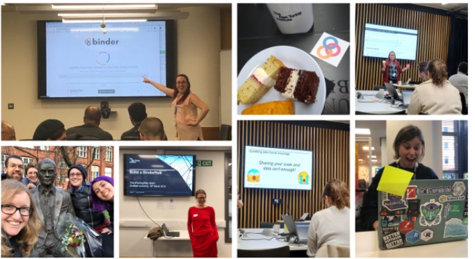

### Collaborations Workshop 2019 (CW19) #CollabW19 

### 2019-04-01 to 2019-04-03

Improving The Turing Way - HP11-CW2CC

### **Hackday Idea Proposer**

Kirstie Whitaker - kwhitaker@turing.ac.uk

---

_This document should be used to capture the information for a Hack Day Idea._

### **Context / Research Domain**

Collaboratively building a resource to make reproducible research “too easy not to do”

### **Problem**

Reproducible research is necessary to ensure that scientific work can be trusted. Funders and publishers are beginning to require that publications include access to the underlying data and the analysis code. The goal is to ensure that all results can be independently verified and built upon in future work. This is sometimes easier said than done. Sharing these research outputs means understanding data management, library sciences, software development, and continuous integration techniques: skills that are not widely taught or expected of academic researchers and data scientists.

### **Solution**

The Turing Way is a handbook to support students, their supervisors, funders and journal editors in ensuring that reproducible data science is “too easy not to do”. It will include training material on version control, analysis testing, and open and transparent communication with future users, and build on Turing Institute case studies and workshops. This project is openly developed and any and all questions, comments and recommendations are welcome at our github repository:[ https://github.com/alan-turing-institute/the-turing-way](https://github.com/alan-turing-institute/the-turing-way).

[https://the-turing-way.netlify.com](https://the-turing-way.netlify.com)

[https://github.com/alan-turing-institute/the-turing-way](https://github.com/alan-turing-institute/the-turing-way-book)

[https://github.com/alan-turing-institute/the-turing-way-book](https://github.com/alan-turing-institute/the-turing-way-book)

[https://gitter.im/alan-turing-institute/the-turing-way](https://gitter.im/alan-turing-institute/the-turing-way)

### **Diagrams / Illustrations**

Come and join our amazing community!! 😍😎🙌👾🌟✨🌈💐

