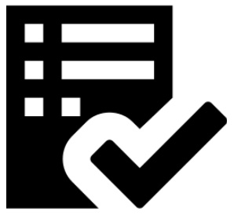

### Collaborations Workshop 2019 (CW19) #CollabW19          2019-04-01 to 2019-04-03

Group 0 - CI15-CW2CC

### **Reporter**

Emmy Tsang - e.tsang@elifesciences.org

### **Participants**

Richard Gilham - [richard.gilham@metoffice.gov.uk](mailto:richard.gilham@metoffice.gov.uk)

Emmy Tsang - [e.tsang@elifesciences.org](mailto:e.tsang@elifesciences.org)

Anna Krystalli - [a.krystalli@sheffield.ac.uk](mailto:a.krystalli@sheffield.ac.uk)

David Gillespie - [d.gillespie@mmu.ac.uk](mailto:d.gillespie@mmu.ac.uk)

---

_This document should be used to capture the information for a Collaborative Session / Hack Day Idea. (The total amount of text should ideally be between 100-300 words and you can include a diagram or two). The document should be no larger than two pages of A4. Don’t delete the details at the top of the document but you should delete all the hint text once you no longer need it._

### **Context / Research Domain**

There are comprehensive, large sets of guidelines on software engineering/research data best practices, but these are often difficult to digest and not easy to act upon. There is a need for the development of an easy-to-use tool that can help users to distil/digest these, with the goal of producing a universal, clear set of guidelines that are easy to adopt (in a checklist format?).

Related resources:

*   Guideline to using Github issues: [https://guides.github.com/features/issues/](https://guides.github.com/features/issues/)
*   DLR software engineering guidelines: [https://zenodo.org/record/1344612#.XKNELOtKifV](https://zenodo.org/record/1344612#.XKNELOtKifV)
*   The Turing Way - [https://github.com/alan-turing-institute/the-turing-way](https://github.com/alan-turing-institute/the-turing-way)
*   Isber best practices for repositories: ISBER BEST PRACTICES FOR REPOSITORIES[https://www.isber.org/page/BPR](https://www.isber.org/page/BPR)

### **Problem**

A lack of accessible generic tools that distill actionable guidance on appropriate practice to support open reproducible research -  what is the appropriate practice for my software/research/dataset? With the aim to facilitate reuse

### **Solution**

A scalable library of customisable handrail checklists of the appropriate practices for software/research/data with infrastructure for domain/task specific variations. This will be backed up by decision-aids to help researchers find what is right for them.

Not every piece of work needs every facet of quality management. A 2-line script has a very different risk profile to, say, a million-line operational weather model. Getting the right amount of quality management and scaling it as your work progresses helps strike the right balance between rigour and innovation.

Many tools exist to help people on their journey, but many different combinations may be used to achieve the desired effect. These checklists will be tool-agnostic, but with signposting to tool-specific solutions. This decouples the decision about the required quality management, the risk assessment, from the tools that are required. Decoupling the risk assessment from the tool choice provides clarity in the journey towards open and reproducible research. The two-step approach also makes it easier for researchers to get on board with the process rather than being overwhelmed by something that feels like a barrier to getting things done.

_Explanation of the solution to the problem you have identified_

### **Diagrams / Illustrations**

_You can include one or two diagrams in this section. Please ensure you have the right to use the image(s), and include an attribution if applicable._

_ATTRIBUTION: GitHub [MIT (http://opensource.org/licenses/mit-license.php) or OFL (http://scripts.sil.org/cms/scripts/page.php?item_id=OFL_web)]_

