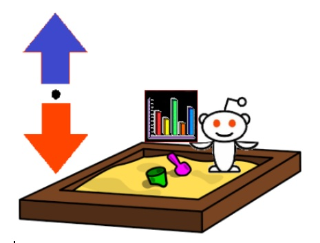
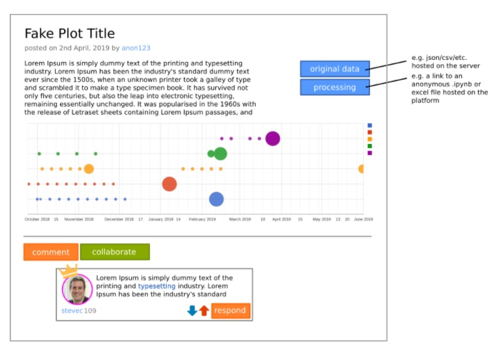

### Collaborations Workshop 2019 (CW19) #CollabW19          2019-04-01 to 2019-04-03

Group 2: The Research Data Sandbox - CI7-CW2CC

### **Reporter**

Steve Crouch - [s.crouch3000@gmail.com](mailto:s.crouch3000@gmail.com) / All

### **Participants**

_Sorrel Harriet, Melodee Beals, Lucia Michielin, Steve Crouch, Mosè Giordano_

---

### **Context / Research Domain**

General research data.

### **Problem**

Many researchers who generate research data face a variety of issues with exposing that data to a wider audience including imposter syndrome or a general lack of confidence with 'putting their data out there'. This might similarly apply to unpublished articles or ideas that have either been rejected or have not developed to the point that they are viable as research assets.

At the same time, there is a significant amount of value in negative results, unkempt datasets and unpublished analysis -- data that is lost or susceptible to unnecessary duplication of effort owing to a culture that rewards data hoarding and reputation sculpting and fails to reward honest documentation of methodological dead-ends and iterative and incremental improvement.

### **Solution**

### The Research Data Sandbox

The Research Data Sandbox is a safe place to publish your research data -- perhaps anonymously -- to try things out, pitch ideas, determine levels of interest in the data, and -- most importantly -- attract suggestions for improvement.

Ethos: Foster a community that understands the importance of openness and that failure or incomplete knowledge is not something to fear

*   Publishers may choose whether or not to publish anonymously.
*   Reviewers may contribute suggestions; constructive criticism; edits etc.
*   Reviewers cannot contribute anonymously, and there will be some system of ranking/discrimination according to the credentials/’upvotes’/affiliations of the individual

A space for narrative anecdotes (A Funny Thing Happened in the Lab) would be a welcome counter to the culture of “Quit Lit”, where “Academic Horror Stories” reinforce unhealthy perfectionism instead of fostering long-term growth and support through numerous development “failures”.

### Possible Expansions

In the future, the further communities Sandboxes could develop around other research assets, such as methodologies, abstracts, research narratives, project case studies, and prose.

### **Diagrams / Illustrations**

Image By Lucia Michielin

