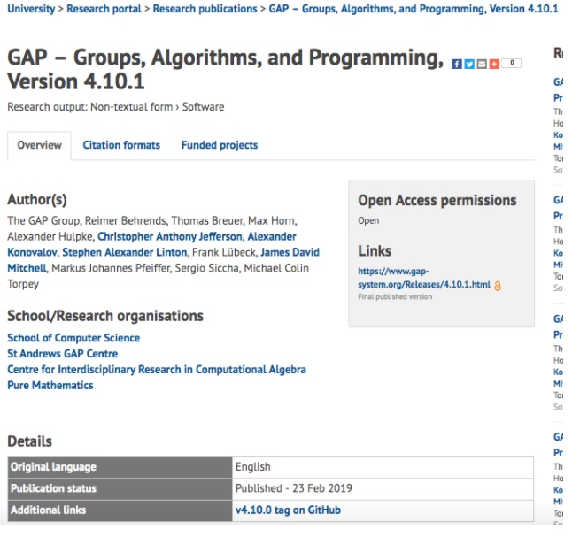

### Collaborations Workshop 2019 (CW19) #CollabW19          2019-04-01 to 2019-04-03

Software reporting guidelines - HP6-CW2CC

### **Hackday Idea Proposer**

Alexander Konovalov - alexander.konovalov@gmail.com

---

_This document should be used to capture the information for a Hack Day Idea._

### **Context / Research Domain**

_Software credit_

### **Problem**

_How to find out which research software is developed in an organisation?_

### **Solution**

_Universities are using various information systems to record research outputs, mainly for REF purposes, for example:_

*   _Pure (St Andrews): [https://www.st-andrews.ac.uk/staff/research/pure/](https://www.st-andrews.ac.uk/staff/research/pure/) _
*   _RIS (Nottingham): [https://www.nottingham.ac.uk/it-services/research/applications/ris.aspx](https://www.nottingham.ac.uk/it-services/research/applications/ris.aspx) _
*   _Simplectic (Leeds): [https://library.leeds.ac.uk/info/14061/open_access/9/deposit_your_research_outputs_in_symplectic](https://library.leeds.ac.uk/info/14061/open_access/9/deposit_your_research_outputs_in_symplectic) _

_However, it is mainly research publications what is being regularly entered into these systems due to REF. Software outputs are not highly visible there. Moreover, public views of these databases highlight publications and possibly datasets (e.g. [https://risweb.st-andrews.ac.uk/portal/en/](https://risweb.st-andrews.ac.uk/portal/en/)) but require using the search interface to select only software outputs._

_We would like to produce a set of recommendations (for example, as a blogpost or a series of pages, one per each system, with screenshots) for:_

*   _Researchers developing and publishing research software (how to publish your software to have meaningful metadata to record)_
*   _University database and research portal managers (to support software developers, and to increase software visibility in the portal)_
*   _Developers of information systems (to create a specific template for software)_

_We think of a bottom up approach: in each University, having sufficiently many software outputs recorded in the system, one could approach university database and research portal managers suggesting to make software easier discoverable on the research portal. At the same time, identify if there are any changes to made in the template for software outputs by the provider of the information system (Elsevier for Pure, etc.). If they will get sufficiently many demands to change it, they may do this with a higher priority. _

_Ideally a team should consist of at least one representatives of universities using each of the information systems, to be able to log in an explore the form for adding a new entry to the system._

### **Diagrams / Illustrations**

_This is an example how the most recent GAP release is represented in the Research Portal, which draws information from Pure. Please ask me to demonstrate the internal view of this record in Pure._

