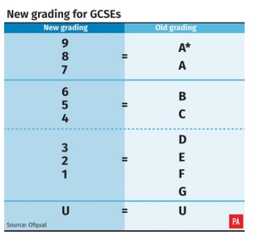

### CW20 - 2020-03-31 to 2020-04-02

Does grade inflation exist? - CI6-CW20

### **Participants**

Jez Cope
Philip Grylls
Pablo Bernabeu
Frances Cooper
Tania Allard

---

### Context / Research Domain

New university students often do not have the skills expected when they begin their degree courses. One reason for this may be that universities are less able to distinguish between student skills due to grade inflation. Grade inflation is the process whereby exam questions become easier each year, meaning more students achieve higher grades. But does grade inflation actually exist?

### **Problem**

*   The secondary education system has recently undergone an overhaul of the grading system to combat grade inflation at the top end. 
*   This can be attributed to a combination of political and societal pressures for better grades along with changes to the background knowledge that students gain before and outside formal education: there isn’t enough data currently to tease these apart
*   This was also seen at the beginning of the last decade in the introduction of A* to A-levels and has been noted in the grade distributions of undergraduate degrees; this is a particular problem as degree entry requirements often fail to track changes to the underlying pre-university curriculum.

### **Solution**

*   Include suggested preparations in addition to prerequisites, especially relevant for cases in which a degree will split into very different routes (e.g., Psychology, Linguistics, ..).
*   Could the grade inflation also be tackled through a behavioural approach, in which lecturers and students would receive expert, unified training about the need to have a coherent grade landscape?
*   We suggest using publicly available data to create an interactive dashboard comparing different viewpoints of the problem including average grade distributions, university admission grades, and the ability to sample topics and questions from different years. 

### **Diagrams / Illustrations**

### Notes from the Ideas Session

---

**Idea A: Problems and solutions to the use of tech in public administration ----**

_Relevant questions:_

*   AI and digital technologies used in the Criminal Justice system.
    *   What is fairness? 
        *   Representative sampling 
        *   Same release rates (ie white vs minority i.e. COMPASS)
        *   Same false positive (are we looking for none)
        *   Facial recognition and targeting
    *   False negatives / false positives in prison release
    *   Boundaries: 
*   Solutions: 
    *   How to test data sets and compare their outcomes to the people they affect
    *   How to robustly test digital technologies against the best criminological theory

**Idea B:  Managing digitised content of the British Library. 0++0**

The British Library (BL) has a vast amount of paper data, some of which has been digitised. 

*   Challenges: 
    *   Digitising as much of this content as possible, which has been highlighted with crises such as Covid-19. 
    *   Even once digitised, making this content available **at scale** has been a challenge. Funding needed.
*   Legal deposit: anything published in the UK must be made available to BL, both print and non-print. This includes the UK Web (.co.uk, .ac.uk, ...). This deposit can only be accessed by someone physically located in a Legal Deposit library[^1] reading room.

*   Solution: Applying firewall policy in BL infrastructure for internal analyses, and publishing results with a secure licence. Redraw relevant law to be able to grant content requests.
    *   The legal problem can’t be addressed by a hackday (if only!) but technological solutions might be possible to improve access within the current law
    *   E.g. DataSHIELD[^2] extended to do text data mining
**Idea C:  Recurrent phone scams ---+**

*   How and can this go on? Is there not enough tech to tackle it?
*   Massive corps (esp. banks) must surely have the necessary information to prevent and resolve these incidents.
*   System: Simple system of matching information would go some way to prevent these incidents. 
*   Is this happening because people are using spreadsheets?

**Idea D:  Limited comp science skills in entry to some degrees +++0**

Solutions: 

*   Build a kind of guide about prerequisites for getting up to speed with some skills.
*   In the context of the decrease in knowledge over time, at a national level, as forced by a gradual grade inflation, a tool could be created to assess this progression. Information could be shared in a data dashboard, achievable in a hack day. Unis would benefit from this tool. Public stats could be used to create this.

**Idea E:  Reproducibility in scientific computing +0 +0**

*   Seen as black and white - whereas the spectrum is more complex. 
*   Solution: Create a reproducibility analyser. When a new release is made, content of the repo can be analysed. Automatic report created including environment spec compared to previous release. 
*   CodeCoverage: how text is changing, how testing is being done. Useful for group leaders. Barrier of entry to somebody else’s research can be understood. 
*   Could be used to create certification as well as personal understanding.
*   _Evolving_ checklist.
*   Consider FAIR data checklist and extend for purpose of reproducibility. Convenient for inclusion of wider community.

Final round!

B

D +++

E +

<!-- Footnotes themselves at the bottom. -->
## Notes

[^1]:

     6 legal deposit libraries in the UK & ROI: The British Library, National Library of Scotland, National Library of Wales, Bodleian Library (University of Oxford), Cambridge University Library, Trinity College Library (Dublin)

[^2]:

     "DataSHIELD | DataSHIELD | Newcastle University." [http://www.datashield.ac.uk/](http://www.datashield.ac.uk/). Accessed 1 Apr. 2020.

