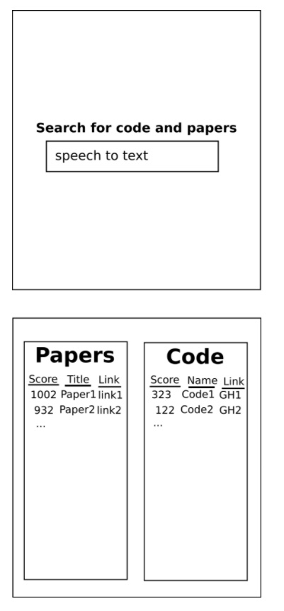

### CW20 - 2020-03-31 to 2020-04-02

Idea 1 - CI1-CW20 - ‘State-of-the-Art’

### **Participants**

Dan Hobley

Paddy McCann

Emily Bell (chair)

Jonathan Frawley (scribe)

Reka Solymosi

Iain Barrass

---

### **Context / Research Domain**

Meta-research: the context is a user doing a literature review for any research software project ('scientometrics'). We’re going to focus our proof-of-concept on speech to text research.

### **Problem**

When starting a project on a topic outside current expertise, it can be difficult and time-consuming to ascertain the current state-of-the-art in terms of tools and techniques. 

Existing literature-search methods can be blunt instruments, and may over-weight long-standing methods (that could now be superseded) or methods employed extensively by one particular successful group. They can also be very time-consuming, especially for the non-specialist (e.g. an RSE reading science publications, and vice versa).

Google scholar _might_ be doing something like this when it ranks your searches, but the approach is very unclear. It also cannot separate out the tools from the publications using them.

### **Solution**

Create a tool for end users (non-technical/technical) to be able to search for resources related to a topic of interest to get them started on learning more about it. 

This tool will help get some sense of what is ‘state-of-the-art’ in an area that’s outside of your expertise, using well-cited papers and well-starred/used Github repositories (weighted by factors such as recency, broadness of uptake, number of contributors etc). 

In the hackday we can build a proof of concept which will consist of a platform where users can search a topic, and be presented with an output of top papers, tools and techniques related to this topic. For the proof of concept this topic will be speech-to-text technology and our imagined target audience will be non-technical users. (For the purposes of the hackday, the searching may not be 'live'.)

The idea is to use data from GitHub API (starring, forking, watching, downloads, etc. stats) and Google Scholar API  (eg who’s citing what/when stats) and create a score while weighting also for 'newness' and any other considerations to produce the top resources and present them back to the user. We would aim to build layers on top of this including expert reviews (not for the hackday but as a next step).

We also want to present the 'score', in a user-friendly way, with the aim to balance including as much detail about our methodology as possible with interpretability by a non-technical audience. (Rotten Tomatoes-style presentation?)

Finally we want to consider the possible biases and other ethical considerations of our project, for example, is it going to result in promotion of established/well known tools and papers at the expense of new/emerging/innovative ones. Consider all possible issues/biases/implications and think about how they can be mitigated, and if they cannot, does this mean this tool should not exist? Documentation is also important to this, so there will be a read.me explaining weighting rationale and contributor guidelines.

### **Diagrams / Illustrations**

##### 

#### General Notes

Daniel idea:

*   Look at legacy research code and figure out how wrong it is
*   Look at metrics such as how frequently it is updated, number of bugs, how quickly they are solved, etc.
* Figure out whether code that research is based on is wrong, and thus whether the conclusions hold up

  

Jonathan idea:

*   Website which gives best tools and top research papers in particular field
*   Goal would be to give someone new to a topic and idea of the state-of-the-art
*   Maybe have voting system as well as looking number of citations, etc.
*   Outcomes: state of the art papers & how do i get started with this the quickest way possible?
*   Distinguish marketing material vs actually best resources (maybe reviews of the paid for services)
*   Research papers v tools?
*   Tools - python packages or large scale? Or anything? - can split by expertise of end user? And techniques and papers? 
*   What would the proof of concept look like? 
    *   Prototype of what we would want 
    *   GitHub API (starring forking watching downloads etc stats) and Google Scholar API to automate (eg who’s citing what/when stats) 
*   Aim of proof of concept: work out level of curation burden
    *   Keyword search for idea, and pull themes from github and papers from scholar weighted by metrics (citations, forking, starring, etc)
    *   Q: how automatable is this? What are some issues/ biases? 
*   Jonathan: Manual curation of reference codes maybe?

What’s our USP?:  This tool will help get some sense of what is ‘state-of-the-art’ in an area that’s outside of your expertise, using well-cited papers and well-starred/used github repositories. 

For proof of concept (hackday project): 

*   Topic: machine learning/ neural net/ whatever Jonathan’s project was
*   Audience: non-technical people

Output: results alongside our 'notes' of why we chose them (something rotten-tomatoes style where we show our method) - report on our metric

