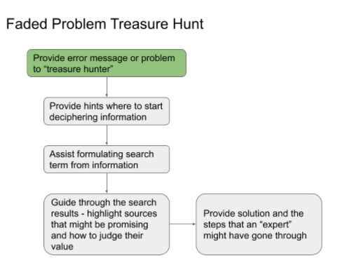
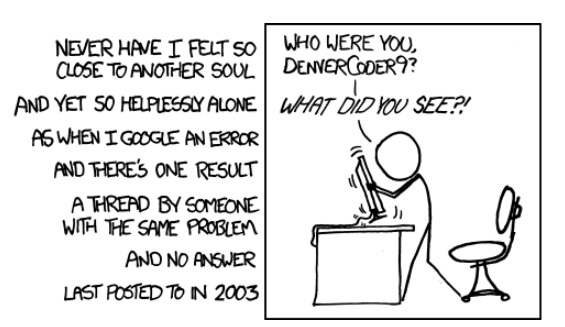

### CW21 - 2021-03-30

Garfield - CI7-CW21

### **Participants**

_Please list the participants here_

Matt Cannon - Taylor & Francis (scribe)

Dominic Kempf / RSE, Heidelberg University

Matthew Bluteau / RSE, UK Atomic Energy Authority

Robin Wilson / Freelance - robin@rtwilson.com

Paddy McCann / RSE, University of St Andrews

---

### Title: DEPTH: Developer Error/Problem Treasure Hunt!  

### **Context / Research Domain**

General RSE audiences, (and really any software developer)

Researchers who are not RSE - could have general or very specific queries.

### **Problem**

It is a specialist skill to be able to decipher error messages and find answers quickly online. These are skills which are not widely taught (and often under-appreciated), but are critical to being an effective developer. Often these kinds of issues are directed to a specific individual within a group/department/company which is not a good use of time/resources. This is particularly a problem for beginner programmers (who may not know what the relevant parts of their problem are), and for people working outside of software development teams with relevant experts.

### **Solution**

We propose an interactive online course to help people with deciphering error messages, building search queries and finding solutions. We propose to do this via a treasure hunt!

The course would start with slides/presentation with_ _basic tips. Then moving on to give examples of errors (for example an error message or stack trace) and asking the students to then try and extract the relevant bits, do the relevant searches and find answers - with some tips along the way. Then follow up with best practice on how ‘the experts’ would have done it.

The examples would be carefully chosen so that the answers are definitely ‘out there’ to find, in various places (StackOverflow, blogs, forums, documentation) - and designed to gradually increase in difficulty. We are aware there would need to be considerations for different programming languages, so would suggest starting with a well-known language - Python.

The course would be designed to be able to be taken online by an individual alone, or alternatively as a ‘taught course’ in a group - potentially as part of a Software Carpentry course. 

### **Diagrams / Illustrations**

Our view of how a “treasure hunt” would work:

_[https://docs.google.com/presentation/d/1g-CBDLqARbWfo82Dkw9H3REcQ4LE_5mcKmwzZR60Zsc/edit?usp=sharing](https://docs.google.com/presentation/d/1g-CBDLqARbWfo82Dkw9H3REcQ4LE_5mcKmwzZR60Zsc/edit?usp=sharing) _

The “faded problem” would be that the intermediate steps would gradually be removed as the difficulty increases.

And for those who have felt the pain of searching for solutions online, we give you this inadequate solace:

_([https://xkcd.com/979/](https://xkcd.com/979/)  licensed CC BY-NC 2.5)_

_Thanks for reading!_

### (l-r - Matt C, Robin, Dominic; Matt B, Paddy) 

### Licence

These materials (unless otherwise specified) are available under the Creative Commons Attribution 4.0 Licence. Please see the [human-readable summary](https://creativecommons.org/licenses/by/4.0/) of the CC BY 4.0 and the full [legal text](https://creativecommons.org/licenses/by/4.0/legalcode) for further information. 

