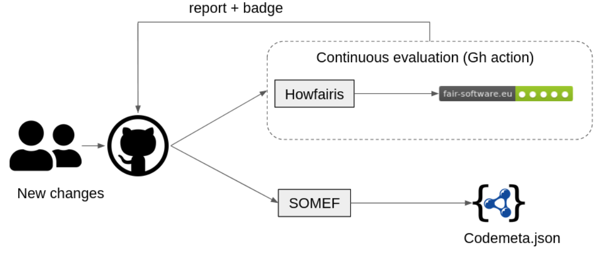
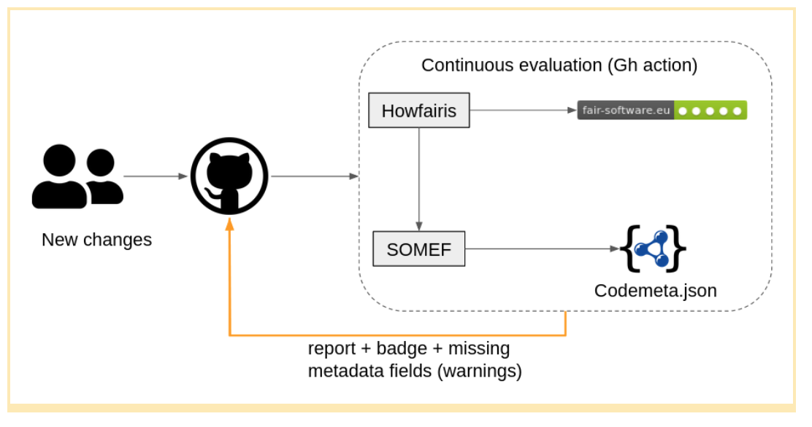

### CW21 Hack Day - 2021-03-31 to 2021-04-01

Hopper-1949 - HP12-CW21

### **Hack Day idea proposer**

**Faruk Diblen, Daniel Garijo, Carlos Martinez, Mathew Bluteau, Paddy McCann**

**Slack: #howdescribedis**

---

_This document should be used to capture the information for a Hack Day Idea._

### **Idea name (provisional)**

_This is the provisional name of the Idea, solution or just a title; this can be changed later if a team is formed and you decide on a new team/product name._

_HowDescribedIs_

*   Further automation of _howfairis_

### **Context and/or research domain**

_Please describe the context and/or research domain to which the problem applies_

[howfairis](https://github.com/fair-software/howfairis/) is a tool to measure level of adherence to the five recommendations on fair-software.eu website. It allows users to automatically check the compliance of their code and produce a badge displaying the score of their software.

Example badge generated by howfairis:

[SOMEF](https://github.com/KnowledgeCaptureAndDiscovery/somef/) is a tool for extracting automatically metadata from code repositories, based on their readme file. SOMEF creates a [Codemeta.json](codemeta.github.io/) file automatically.

### **Problem**

_Description of the problem you are trying to solve_

_howfairis_ aims to be as easy-to-use as possible for researchers. However, meeting these recommendations requires some manual labor. We would like to automate this as much as possible, for example by automatically generating Codemeta.json files for your repo based on the descriptions that are already there.

**Solution**

_Explanation of the solution to the problem you have identified_

[SOMEF ](https://github.com/KnowledgeCaptureAndDiscovery/somef/)can help generate codemeta files automatically. With the information identified by SOMEF, we can determine which metadata is missing, hence prompting developers to improve their readmes with that information, or complete the Codemeta.json files created by SOMEF.

We would like to create a GitHub action which makes this happen automatically.

Thanks to this work, users will help structure their software descriptions in a machine-readable manner, making them easier to find (through keywords, faceted search, etc.)

### **Diagrams / illustrations**

_You can include diagrams in this section. Please ensure you have the right to use the image(s), and include an attribution if applicable._

**_Current workflow:_**

**_Proposed approach:_**

## Action plan for hackday

*   Test somef
*   Test howfairis
*   Howfairis GH action:
*   Create initial GH action that checks if there is a codemeta (or citation?) file
    *   If not, run SOMEF
*   (Step 0) Overview of GitHub Actions
*   (Step 1) Github action to generate codemeta.json
*   (Step 1.1) Create codemeta.json
*   (Step 1.2) Send a PR with created file
*   (Step 2) Detect citation information is present (codemeta.json)
*   (Step 2.1) If not, run action from Step 1)
*   