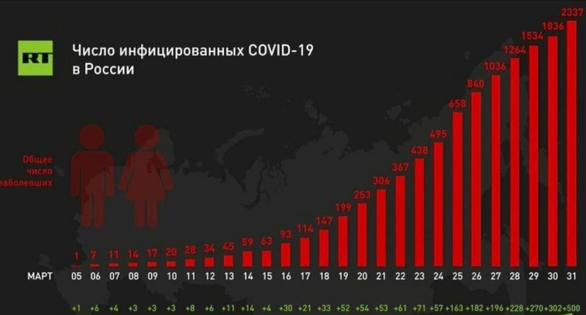
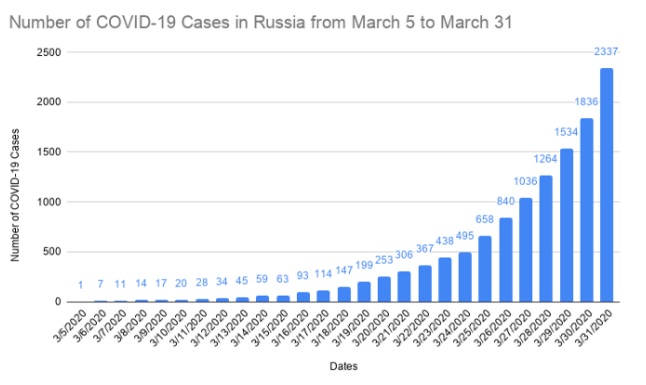

### CW21 - 2021-03-30

Heathcliff - CI8-CW21

### **Participants**

_Please list the participants here_

_Connie Clare_

_Louise Brown_

_Sam Haynes_

_Will Furnass_

_Patricia Herterich_

---

### **Problem**

Improving data visualization literacy

**Research domain:**

Research communication / Data science / Visualization 

“Follow the science” has become the tagline for 2020, but what is “the science”? Who defines it and is it really infallible?

_We have all seen many graphs and statistical summaries over the last 12 months, many of them not being clear to a lay audience. This might have been because they were, accidentally or deliberately, too complex or misleading. It can be difficult for the public to interpret data and graphs._

### **Solution**

_Provide a tool which will enable the public to be able to interpret and robustly critique interpretations of data presented in the media and decide whether they are showing what they claim to show._

**_Phase 1_**

_Create an interactive website to show different interpretations of the same data, including many data visualisation faux pas from press articles relating to issues of broad interest. Show examples of the same set of data displayed in different ways._

_The sort of problems that examples might expose could be log scales with 0 value, adjacent graphs with vastly different scales, heat maps with similar colour schemes but different values, disjoint axes. This could be accompanied by prose describing practices or alternative graphics that address the highlighted issues._

**_Phase 2_**

_Growing a community for exposing the misrepresentation of data. People can highlight examples of data visualisation/statistics that they want to question and other people/experts can pick apart issues or suggest different interpretations._

**_Phase 3_**

_Creating a peer review process for that community similar to the rOpenSci community to ensure that proposed reinterpretations of graphics and statistical summaries are of sufficient quality. _

### **Diagrams / Illustrations**

_You can include one or two diagrams in this section. Please ensure you have the right to use the image(s), and include an attribution if applicable._

_(https://towardsdatascience.com/stopping-covid-19-with-misleading-graphs-6812a61a57c9)_

### Licence

These materials (unless otherwise specified) are available under the Creative Commons Attribution 4.0 Licence. Please see the [human-readable summary](https://creativecommons.org/licenses/by/4.0/) of the CC BY 4.0 and the full [legal text](https://creativecommons.org/licenses/by/4.0/legalcode) for further information. 

### Team 

