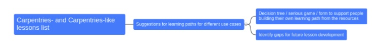

### CW21 - 2021-03-30

Koko - CI11-CW21

### **Participants**

*   Stephan Druskat ([stephan.druskat@dlr.de](mailto:stephan.druskat@dlr.de))
*   Sammie Buzzard ([BuzzardS@cardiff.ac.uk](mailto:BuzzardS@cardiff.ac.uk))
*   Bailey Harrington ([baileythegreen@gmail.com](mailto:baileythegreen@gmail.com))
*   Leyla Jael G. Castro ([ljgarcia@zbmed.de](mailto:ljgarcia@zbmed.de))
*   Abhishek Dasgupta   ([abhishek.dasgupta@cs.ox.ac.uk](mailto:abhishek.dasgupta@cs.ox.ac.uk))

    

---

## _The Adventurous Architect_ - \
A Blueprinter for Research Software Skills

### **Context / Research Domain**

_Cross-domain (research software education/learning)_

### **Problem**

Learners completing a basic Software (or other) Carpentry workshop don’t have clear next steps for how to continue their education, and those next steps will be different for many career paths.

At the same time, there exist many Carpentries-like lessons “in the wild” that complement the core Carpentries lessons, adapt them to specific situations at institutions or other working environments (e.g., high-performance computing), or specific learning requirements for domains. There is also a need for more ‘intermediate’ Carpentries or Carpentry-style lessons for tools that are useful for software development, such as Vim/Emacs and IDEs; for testing software, such as continuous integration; and for making code nicely formatted and correcting common errors, such as linters.

### **Solution**

Create a curated list of Carpentries and Carpentries-based lessons which will help learners who have completed the software carpentry curriculum (introductory courses on shell, Git, and Python/R) to find their next course. Based on this list, creating a decision tree will help people pick their custom learning path across all these Carpentries and Carpentries-like resources.

The decision tree can also be used as input for a serious game or form to help people build their learning path, based on an endpoint, e.g., a specific skill set. 

At the same time, using the decision tree will help identify gaps in the Carpentries curriculum, and can support the development of new, especially intermediate, lessons.

Later, an AI-based recommender system can suggest useful learning paths based on inputs describing a specific research situation: “Hello System, I have this genomics dataset in JSON and want to do reproducible research on it to visualize this-and-that. I have done a Carpentries Git lesson but cannot use Python for this project, what should I learn?”

### **Diagrams / Illustrations**

### Licence

These materials (unless otherwise specified) are available under the Creative Commons Attribution 4.0 Licence. Please see the [human-readable summary](https://creativecommons.org/licenses/by/4.0/) of the CC BY 4.0 and the full [legal text](https://creativecommons.org/licenses/by/4.0/legalcode) for further information. 

