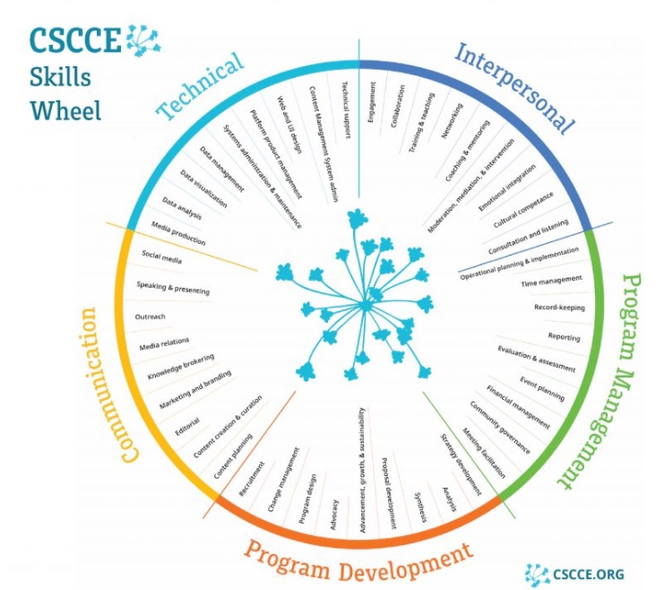

o### CW21 - 2021-03-30

Macavity - CI13-CW21

### **Participants**

_Louise Chisholm_

_Malin Sandstrom (chair?)_

_Florian Mannseicher_

_Emma Karoune (scribe)_

_Andrew Brown (scribe)_

---

_This document should be used to capture the information for a Collaborative Session / Hack Day Idea. (The total amount of text should ideally be between 100-300 words and you can include a diagram or two). The document should be no larger than two pages of A4. Don’t delete the details at the top of the document but you should delete all of this hint text (Arial, italic, grey, size 11) once you no longer need it._

**IDEAS:**

**Skills Wheel for RSEs**

_Ideas:_

_Community management_

_How to be an RSE: define the professional identity, especially for young people starting out_

_Training materials portal: practices, tools, languages etc. _

_Carpentries address skills, this portal could address the (professional?) framework_

_Skills wheel_

_Different ways into RSE: direct training, researchers who incorporate RSE practices etc. how to merge these?_

_How to start with diversity_

_Overview of skills, followed by specialisation_

_Encourage long term thinking: documenting workflow (e.g) _

_Explaining why best practice is important _

_Soft skills: empowering research, communication etc.  _

_Resources in The Turing Way - [https://the-turing-way.netlify.app/welcome](https://the-turing-way.netlify.app/welcome)_

### **Context / Research Domain**

_Researchers developing software skills_

### **Problem**

_It can be difficult for researchers new to software development to orient themselves in the professional RSE landscape, and find out how to develop the skills needed. Some researchers develop their skills in an ad hoc way based on specific research project needs, while others are trained as software engineers specifically. This will impact the development of the community, especially the ‘onboarding’ of new members. Researchers who do not have programming background need a level of understanding of research software, while those with a technical or research background may need more training in the professional or soft skills. While many resources are available for each specific area, the intersection of required skills and knowledge for RSE may make the community seem inaccessible._

### **Solution**

_Explanation of the solution to the problem you have identified_

**_Provide a ‘front-end’ for RSE-skills resources, resolved into Professional, Technical and Soft skills, to allow people coming from different backgrounds and communities better to find the information they need. _**

**_“Enabling tool development in research” portal_**

*   _Professional skills for RSE_
    *   _ data management and governance, FAIR, research reproducibility, licensing, project design, costing projects, managing a team, Continuous Professional Development, mentoring, recognition/authorship for contributions, _
*   _Technical skills for research software engineering _
    *   _programming languages, research reproducibility tools, engineering thinking, version control, file formats, testing, pedagogy_
*   _Soft skills _
    *   _communication, awareness of accessibility, digital collaboration, user forum, community building_
    *   _Community mgmt 101_
    *   _[https://www.software.ac.uk/top-tips-managing-your-open-source-project-community-effectively](https://www.software.ac.uk/top-tips-managing-your-open-source-project-community-effectively)_

_In the portal develop a skills wheel/venn diagram and link to professional requirements and resources i _

**_Creating a course for researchers who do not code or data to understand engineering thinking and concepts that are important in research software engineering and data analysis._**

### **Diagrams / Illustrations**

_We suggest adapting/using the idea of the wheel from CSCCE developed for Community managers and reuse idea for RSE skills and to make it interactive, so people can explore the different skills. Each skill will be linked to training resources/courses so that each skill can be explored and developed by the reader._

_[What does a scientific community manager do? Check out the CSCCE Skills Wheel and accompanying guidebook! - CSCCE](https://www.cscce.org/2021/01/25/what-does-a-scientific-community-manager-do-check-out-the-cscce-skills-wheel-and-accompanying-guidebook/)_

### Licence

These materials (unless otherwise specified) are available under the Creative Commons Attribution 4.0 Licence. Please see the [human-readable summary](https://creativecommons.org/licenses/by/4.0/) of the CC BY 4.0 and the full [legal text](https://creativecommons.org/licenses/by/4.0/legalcode) for further information. 

