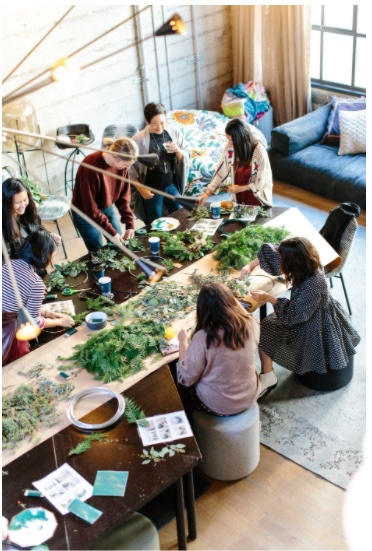

### CW21 - 2021-03-30

Charlie - CI3-CW21

### Running a Dugnad in a research group

### **Participants**

_Please list the participants here_

Sarah Gibson

Sarah Jaffa

Warrick Ball

Neil Chue Hong

---

_This document should be used to capture the information for a Collaborative Session / Hack Day Idea. (The total amount of text should ideally be between 100-300 words and you can include a diagram or two). The document should be no larger than two pages of A4. Don’t delete the details at the top of the document but you should delete all of this hint text (Arial, italic, grey, size 11) once you no longer need it._

### **Context / Research Domain**

_Please describe the context or research domain to which the problem applies_

Astrophysics (as a pilot for other areas with similar deepset culture issues)

### **Problem**

_Description of the problem you are trying to solve_

In astrophysics, there are a lot of self-taught coders who are not being trained in practices that would make their lives easier, including software engineering, using tools like version control, reproducibility for yourself through continuous integration/analysis.

Codes for astrophysics simulations are often built over many years, not documented or tested, with no structure for passing on knowledge - knowledge that is lost when people leave as accounts are deleted. This means the continuity of knowledge within a research group is lost. 

ECRs recognise this, but people in power think it’s a timesink to encourage ECRs to pursue training in these topics. How can we get the decision makers on board? How do we get buy-in? Often evidence of impact is not enough on its own.

What is needed are ways of improving group practices, that help a group lead and the members of the group. By emphasising the importance to the research group, it becomes easier to get buy-in. By making it social and communal, it helps improve group cohesion and identity.

### **Solution**

_Explanation of the solution to the problem you have identified_

#### Running a [Dugnad](https://en.wikipedia.org/wiki/Communal_work#Norway) in a research group

A [dugnad](https://en.wikipedia.org/wiki/Communal_work#Norway) is a Norwegian term for voluntary work done as a group, where a community comes together to collaborate on communal tasks. This is often accompanied by social aspects, such as a shared meal.

We propose running dugnads for research groups that bring together all group members to collectively undertake important research software tasks. More experienced members might tackle important software sustainability issues, while less experienced coders can learn from observing and discussing and still help the group by performing other ‘group admin’ tasks such as writing updates for the website, testing others code and giving feedback on ease of use from a novice perspective, or try some code challenges to improve their skills.

Benefits of running at a group level:

*   Group cohesion and sharing best practice
*   Work from students and postdocs on short term contracts can be collated into a group repository and shared with others within the group, so knowledge and code is not lost when they move institutions or leave the field.
*   Community standards can be shared so that work can be easily transferred between people in the group, new students can hit the ground running using specialised tools rather than reinventing the wheel every time (wastes time, more error prone).
*   Research cohesion for the lead of the group
*   Social aspect: becoming familiar with each other’s work, not feeling isolated with an issue

The outputs from a hackathon related to this idea would be:

*   A set of example dugnads (see below for potential ideas) with agendas, potential tasks, and tips for how to make it fun/social
*   Exemplars showing how these different dugnad types could be applied to astrophysics groups and beyond the domain
*   An engagement and communication plan that describes how successful examples of dugnads that have been run could be disseminated to the community, to persuade them to run their own (e.g. incorporating as a chapter in the Turing Way)

Things that might happen at a successful Dugnad:

*   Postdoc A and PhD student B both use an old F77 simulations code. Postdoc A has some scripts to make it easier to create input files, which, motivated by B, they document and add to the group repository.
*   New PhD student Z sits with finishing PhD student Y and learns some basic version control skills.
*   Latest results and project ideas can be added to the University or Group webpage to advertise to potential collaborators, hires and funders. Makes the group look more active.
*   New postdoc B has joined from a slightly different research area but quickly survey’s the group’s public webpages and creates a list of changes to request from IT. 
*   PI notices that Postdoc C could use an obscure option in the F77 monster that would make it run a bit faster, though without changing scientific results (and hence they’d never discussed it before).
*   The PI sees how amazing sustainable software practices are, even internally, and becomes evangelical.
*   Someone found and fixed an obscure bug in an external code. More experienced Git users can help them learn how to push that back to the main repository so the developers and wider community benefit from the fix.
*   Everyone can bring snacks and cake! Maybe have a cheese and biscuit day or encourage celebration of diverse backgrounds by asking everyone to bring a food from their hometown.
*   A PhD student went on a Python course and learned to use a new library for fancy interactive plotting. They give a short demonstration and help other group members try it out on their own plots.
*   A postdoc is about to release a new code and has written documentation. Other group members can try to install and use it following their documentation and point out where they get confused or any problems that crop up on different platforms.

### **Diagrams / Illustrations**

_You can include one or two diagrams in this section. Please ensure you have the right to use the image(s), and include an attribution if applicable._

Unsplash reference: https://unsplash.com/photos/TdpSX7XAcKo

### Licence

These materials (unless otherwise specified) are available under the Creative Commons Attribution 4.0 Licence. Please see the [human-readable summary](https://creativecommons.org/licenses/by/4.0/) of the CC BY 4.0 and the full [legal text](https://creativecommons.org/licenses/by/4.0/legalcode) for further information. 

