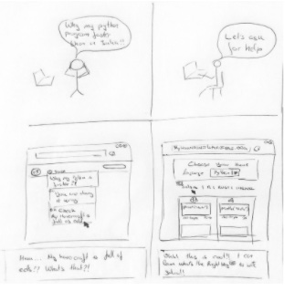

### Collaborations Workshop 2019 (CW19) #CollabW19          2019-04-01 to 2019-04-03

Group 10 Idea - CI13-CW2CC

### Reporter

Niall Beard - niallbeard@gmail.com

### Participants

Jakob S. Jørgensen - jakob.jorgensen@manchester.ac.uk

Lucy Whalley - lucywhalley@gmail.com

David Pérez-Suárez - d.perez-suarz@ucl.ac.uk

Sarah Stewart - sarah.stewart@bl.uk

Benjamin Lee - benjamin_lee@college.harvard.edu

---

_This document should be used to capture the information for a Collaborative Session / Hack Day Idea. (The total amount of text should ideally be between 100-300 words and you can include a diagram or two). The document should be no larger than two pages of A4. Don’t delete the details at the top of the document but you should delete all the hint text once you no longer need it._

### Context / Research Domain

_Please describe the context or research domain to which the problem applies_

Training about Programming

### Problem

_Description of the problem you are trying to solve_

There was a wonderful flash talk on Monday about hovercraft and eels. The concept was that people try out new coding languages by using the paradigms and concepts of languages they’re already familiar with. However, this often doesn’t take advantage of the powerful features of the new language. This can mean they don’t get the benefits, they could suffer worse performance, and/or they find it difficult to write efficient and functioning code. 

### Solution

_Explanation of the solution to the problem you have identified_

**My hovercraft is full of eels**

A training page that surfaces the different programming idiosyncrasies by offering them in the context of a language familiar to the learner. 

A developer seeking to learn a new language will:

1. Select their target language (the language they’re seeking to learn) 
2. Select their home language (the language they’re most comfortable with)
3. Select their current proficiency in the target language.  \

The site then presents a code implementation example in the _target language_ side-by-side with the same implementation in the _home language_. 

_About the implementation_

The examples can easily be harvested from a website called [Rosetta Code](http://www.rosettacode.org/) which offers example code in multiple implementations. We can select some examples that match the different tiers of proficiencies (e.g. beginner, intermediate, advanced). 

_Possible Extension_

**Semantic Annotations**

Additionally, we could add semantic data to WikiData for the Rosetta Code page in order to specify what program concepts each example covers. This would enable a user to select something like ‘show me how to thread/make a web-server/iterate in Ruby as someone who knows Python’.

**Performance**

Display benchmarking data for each of the examples. 

**Community annotations**

There are lots of ways of implementing things. Some are better than others in different usages, languages, constraints, and contexts. A community effort could be initiated to create a cumulative knowledge-base that allows users to discover the algorithms most useful for their use case. The community can contribute new example implementations, refine existing ones, and 

**Jupyter Notebooks**

Have these snippets as executable notebooks within the page

### Diagrams / Illustrations

_You can include one or two diagrams in this section. Please ensure you have the right to use the image(s), and include an attribution if applicable._

>>>>>  gd2md-html alert: inline image link here (to images/image2.jpg). Store image on your image server and adjust path/filename/extension if necessary.  (<a href="#">Back to top</a>)(<a href="#gdcalert3">Next alert</a>) >>>>> 

### 

### Links:

Rosetta Code data here:

[https://github.com/acmeism/RosettaCodeData](https://github.com/acmeism/RosettaCodeData)

Links to existing collections of guides on how to go from one language to another. 

A number of resources already exist providing introductions to features of a specific programming language, targeted at programmers familiar with other programming languages, for example

*   Moving to Python from other languages: [https://wiki.python.org/moin/MovingToPythonFromOtherLanguages](https://wiki.python.org/moin/MovingToPythonFromOtherLanguages)
*   Numpy for Matlab users: [https://docs.scipy.org/doc/numpy/user/numpy-for-matlab-users.html](https://docs.scipy.org/doc/numpy/user/numpy-for-matlab-users.html)
*   R for programmers used to other languages: [https://www.johndcook.com/blog/r_language_for_programmers/](https://www.johndcook.com/blog/r_language_for_programmers/)
*   To Ruby from C/C++, Java, Perl, PHP, Python: [https://www.ruby-lang.org/en/documentation/ruby-from-other-languages/](https://www.ruby-lang.org/en/documentation/ruby-from-other-languages/)
*   Matlab for C/C++ developers, video: [https://www.mathworks.com/videos/matlab-for-cc-programmers-81699.html](https://www.mathworks.com/videos/matlab-for-cc-programmers-81699.html)
*   C for python programmers: 

    [http://www.toves.org/books/cpy/](http://www.toves.org/books/cpy/)

*   [https://rosetta.alhur.es/](https://rosetta.alhur.es/)

These resources are helpful but limited to non-interactive, simple lists of commands in isolation. 

What “My hovercraft is full of eels” provides is a dual side-by-side interactive notebook with comparisons of a feature implemented in the language a user is familiar with and a reference implementation done The Right Way in the new language.

**Ideas for design **

_Table format_

>>>>>  gd2md-html alert: inline image link here (to images/image3.jpg). Store image on your image server and adjust path/filename/extension if necessary.  (<a href="#">Back to top</a>)(<a href="#gdcalert4">Next alert</a>) >>>>> 

_Select box & Visualisation_

>>>>>  gd2md-html alert: inline image link here (to images/image4.jpg). Store image on your image server and adjust path/filename/extension if necessary.  (<a href="#">Back to top</a>)(<a href="#gdcalert5">Next alert</a>) >>>>> 

_ of Options_

